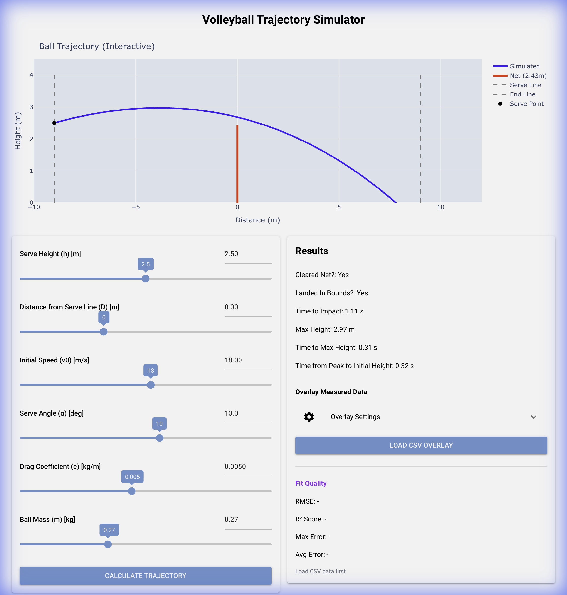

# Volleyball Trajectory Simulator

A Python application to simulate volleyball trajectories and compare them against real-world data.



## Features

*   **Physics Simulation**: Calculates ball trajectory using Euler's method, considering gravity and drag.
*   **Data Overlay**: Load existing CSV files (`x_meter`, `y_meter`) to overlay measured data on the simulation.
*   **Fit Quality**: Real-time R² and RMSE analysis to quantify how well the simulation matches reality.
*   **Interactive GUI**: Built with NiceGUI for easy parameter adjustment and visualization.

## Example Data

A sample CSV file `horizontal_throw_tracking.csv` is included in the repository. You can use this file to test the "Overlay Measured Data" feature. It contains real-world tracking data of a ball thrown horizontally.

## Installation

1.  Clone the repository:
    ```bash
    git clone https://github.com/Harelzx/Physics.git
    cd Physics
    ```

2.  Install dependencies:
    ```bash
    pip install -r requirements.txt
    ```

## Usage

Run the main application:
```bash
python3 main.py
```

### 1. Set Simulation Parameters
Adjust the sliders to set the physical conditions:
*   **Serve Height (h)**: Height where the ball is hit.
*   **Initial Speed (v0)**: Speed of the ball in m/s.
*   **Serve Angle (α)**: Angle of the serve in degrees.
*   **Ball Mass (m)**: Standard volleyball mass (default 0.27 kg).

### 2. Compare with Real Data
If you have tracking data (e.g., from a video analysis tool exported as CSV):
1.  Locate the **"Overlay Measured Data"** section in the right column.
2.  Click **"Load CSV Overlay"**.
3.  Select your CSV file.
4.  The app will overlay your data (green dots) and calculate the **Refit Quality** (R² score).

## Requirements
*   Python 3.x
*   nicegui
*   plotly
*   numpy
*   aiofiles
